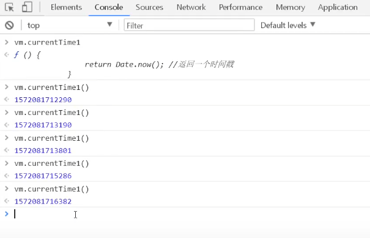

# Vue

## 在线引入

```
<script src="https://cdn.staticfile.org/vue/2.2.2/vue.min.js"></script>
```

## 简单的例子

```
<!DOCTYPE html>
<html lang="en">
<head>
    <meta charset="UTF-8">
    <title>Title</title>
    <script src="https://cdn.staticfile.org/vue/2.2.2/vue.min.js"></script>
</head>
<body>
<div id="app">
{{message}}
</div>
<script>
    var vm=new Vue({
        el:"#app",
        data:{
            message:"你可真是个帅哥"
        }
    })
</script>
</body>
</html>
```

## V指令

### V-bind

<span v-bind:tittle="message">将该元素节点的title特性和Vue实例的message属性保持一致

### v-if

```
<h1 v-if="ok">YES</h1>
<h1 v-else>No</h1>
```

当ok为true时，就只会显示YES

当ok为false时，就只会显示No

### v-for

循环data中的数组

```
<li v-for="item in items">
	{{item.message}}
</li>

data:{
	items:[
		{呜呼啦呼},
		{黑魔仙变身}
	]
}
```

### v-on

时间绑定，将按钮绑定methods中的方法

```
<!DOCTYPE html>
<html lang="en">
<head>
    <meta charset="UTF-8">
    <title>Title</title>
    <script src="https://cdn.staticfile.org/vue/2.2.2/vue.min.js"></script>
</head>
<body>
<div id="app">
<button v-on:click="sayhi">click me</button>
</div>
<script>
    var vm=new Vue({
        el:"#app",
        data:{
            message:"你可真是个帅哥"
        },
        methods:{
            sayhi:function () {
                alert(this.message);
            }
        }
    })
</script>
</body>
</html>
```

注：methods必须为methods，如果是method会显示不成功！

### v-model

双向绑定

## Axios

Vue是视图层框架，作者尤雨溪严格遵守SoC（关注度分离原则），所以Vue.js并不包涵AJAX的通信功能，为解决通信问题，作者单独开发了一个名为vue-resource的插件。

在线引用：

```
<script src="https://unpkg.com/axios/dist/axios.min.js"></script>
```

## 计算属性

计算属性是Vue的特色，

当调用Vue中的methods时需要加上括号，不然调用不成功


计算属性和methods方法的区别


上图代码运行结果为：


重点：当我们在网页中调用vm.currentTime1()时，我们可以发现返回的结果是在变化的

但我们调用vm.currentTime2()时，报错，显示不是方法，并且调用vm.currentTime2，返回的结果始终是一个值，说明vm.currentTime2是个属性不是方法


## slot 插槽

