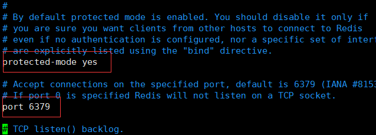
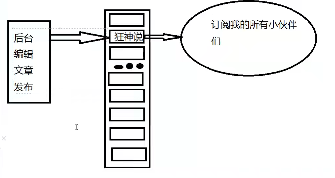

# Redis(狂神说视频学习)

## 为什么要用Nosql？

> 1.单机时代

为什么关系数据库不行了？

大数据：一般的数据库无法进行分析处理了 2006年 Hadoop发布

以前的网站是静态得，服务器压力不大

整个网站得瓶颈：

1.数据量太大，一个机器放不下

2.数据得索引（B+ tree），一个机器内存也放不下

3.访问量一个服务器承受不了

出现三种情况之一就得晋级

> 2.Memcahed（缓存）+Mysql+垂直拆分

读写分离


mysql2写内容，同步到1和3

1、3负责读数据库

为了避免不同用户查询同样得数据，多次访问同样得sql很浪费资源，为了减轻数据库压力，可以再查询中设一个缓存保证效率


> 3.分库分表+水平拆分+Mysql集群


早年MyISAM：表锁，在查一个东西的时候会把整个表锁定，直到出结果，这样十分影响效率，在高并发下会出现严重得锁问题。

转战Innodb：行锁

后来就使用分库分表来解决“写”的压力，Mysql推出了分表区（没啥人用）

Mysql的集群，满足了基本需求

> 4.如今最近年代

Mysql等关系数据库不够用！数据量很多，变化很大

Mysql有的使用它来存储大的文件，博客，图片等，这样导致效率低，若单独处理这些大数据，就可以减轻压力


> 5.为什么要用Nosql

用户的个人信息，社交网络，地理位置，自己产生的数据爆发式增长，Nosql可以很好的处理

NOSQL=not only SQL


个人信息，社交网络，地理位置 这些数据类型不需要固定格式，不需要多月的操作就可以横向扩展！ Map<String,Object> 典型的通过键值对来控制。

> 6.NoSQL特点

解耦！

1.方便扩展（数据之间没有关系，很好扩展）

2.大数据量高性能（Redis 一秒写8w次，读取11w次，NoSQL的缓存，性能比较高）

3.数据类型多样性（不需要事先设计数据库，随取随用）

(../.vuepress/public/assets/img/image-20211209141913786.png)


> 了解 3v+3高

大数据时代的3V：

1.海量Volume

2.多样Variety

3.实时Velocity

大数据时代的3高：

1.高并发

2.高可托

3.高性能

## NoSQL四大分类

KV键值对：

- 新浪：Redis
- 美团：Redis+Tair
- 百度、阿里：Redis+memecache

文档型数据库（Bson格式和json一样）：

- MogoDB
  - MongoDB是基于分布式文件存储数据库，c++编写，主要用于大量文档
  - MongoDB介于关系型数据库和非关系型数据库之间的中间产品，它是非关系型数据库最丰富最像关系型数据库的！
- ConthDB

**列存储数据库**

- HBase
- 分布式文件系统

**图关系数据库**

- 关系拓扑图，存储的不是图，是关系
- Neo4j，infoGrid

### **四大分类区别**


## Redis入门

Redis = Remote Dictionary Server 远程字典服务

是一个开源的使用ANSI [C语言](https://baike.baidu.com/item/C语言)编写、支持网络、可基于内存亦可持久化的日志型、Key-Value[数据库](https://baike.baidu.com/item/数据库/103728)，并提供多种语言的API。从2010年3月15日起，Redis的开发工作由VMware主持。从2013年5月开始，Redis的开发由[Pivotal](https://baike.baidu.com/item/Pivotal)赞助。

> ​	Redis能干什么

1. 内存存储、持久化、内存中是断电即失，因此持久化很重要
2. 效率高、高速存储
3. 发布订阅系统
4. 地图信息分析
5. 计时器、计数器
6. 。。。。

>特性

1. 多样数据类型
2. 持久化
3. 集群
4. 事务

> 学习中需要用到的东西

1. 狂神的公众号
2. Redis官网

### Linux安装Redis

下载最新安装包

当前环境 Centos7.9  java1.8.0_311

redis-6.2.6

1. 将压缩包通过 xshell 传到CentOs的 /opt文件夹中

2. ```
   tar zxvf redis-6.2.6.tar.gz
   ```

   #进入 解压后的文件 可以访问redis.conf文件 查看其配置 

3. redis是由c++写的 因此要先编译后才能运行

   先安装gcc

   ```
   yum -y install gcc gcc-c++ autoconf make
   ```

4. 在redis文件夹目录下

   ```
   make
   ```

5. 再次make

   ```
   make
   ```

    
   

6.

```
make install
```


7.确认redis安装是否完成

redis默认安装路径为 /usr/local/bin


8.将redis配置文件，复制到当前目录文件

在bin中创建一个文件夹再将redis.conf复制过来，这样就是用文件夹中的conf文件，原声文件不要动

```
mkdir /Rconfig


cp /opt/redis-6.2.6/redis.conf redis-config
```


9.redis默认不是后台启动，需要修改配置

```
vim redis.conf
```


10.启动redis服务

```
redis-server Rconfig/redis.conf
//当我把daemonize改为yes后就没了输出信息，不知道为什么但查找进程发现他是启动了的

ps -ef|grep redis 
//查找redis进程

kill -9 pid 杀死进程
pid是第二列数字

```


```
上方 使用redis客户端连接
ping通了就是pong
set get的方法存取键值属性


keys * 查看所有键值
```

11.如何关闭 redis服务

```
shutdown
exit
```


12.再次查看进程是否存在

```
ps -ef|grep redis 
//查找redis进程
```


进程都已关闭！

### 测试功能

redis-benchmark是官方自带的压力测试


```
#测试：100个并发连接 100000请求
redis-benchmark -h localhost -p -c 100 -n 100000
```

### 基础知识

redis默认有16个数据库


使用的是第0个数据库

可以使用**select**进行切换数据库

使用**dbsize**查询数据库大小


清除当前数据库 **flushdb**

清除所有数据库内容 **flushall**

查询当前数据库所有信息 **keys ***

把一个属性移到别的数据库 **movbe name 1** 把name键值移动到1号数据库

> Redis是单线程的

Redis是很快的，Redis基于内存操作，PU不是Redis性能瓶颈，Redis的瓶颈是根据机器内存和带宽，既然单线程可以实现，那就使用单线程了。

Redis是C语言写的，官方提供数据为100000+的QPS，完全不比同样使用key-vale的Memecache差

> 为什么Redis是单线程还那么快？

1. 误区1：高性能的服务器一定是多线程的？
2. 误区2：多线程一定比单线程效率高

先去CPU>内存>硬盘的速度要有所了解

**核心：redis是将所有数据放在内存中，所以使用单线程去操作效率就是最高的，对于内存系统来说，没有上下文切换就是效率最高的！**


## 五大数据类型

### Redis-Key

```bash
127.0.0.1:6379> set name lihao #存储键值
OK
127.0.0.1:6379> set age 18
OK
127.0.0.1:6379> keys * #查询所有键值
1) "name"
2) "age"
127.0.0.1:6379> exists name #查询该键值是否存在
(integer) 1
127.0.0.1:6379> Exists name1 
(integer) 0
127.0.0.1:6379> move name 1 #将name移动到1号数据库，当前为0号
(integer) 1
127.0.0.1:6379> keys * #查询所有建制，move成功
1) "age"
127.0.0.1:6379> set name lihao
OK
127.0.0.1:6379> keys *
1) "name"
2) "age"
127.0.0.1:6379> get name #查询键值里存储的内容
"lihao"
127.0.0.1:6379> expire name 10 #name 10秒后删除
(integer) 1
127.0.0.1:6379> ttl name #查询name查询的时间，单位为秒
(integer) 3
127.0.0.1:6379> ttl name #为负说明已经删除了
(integer) -2
127.0.0.1:6379> get name #获取键值为空
(nil)

```


### String（字符串）

```bash
127.0.0.1:6379> set key1 v1 #设置值
OK
127.0.0.1:6379> get key1 #获得值
"v1"
127.0.0.1:6379> exists key1 #判断值是否存在
(integer) 1
127.0.0.1:6379> APPEND key1 "hello" #判断键值是否存在，若存在就在后面加上内容，若不存在相当于set key1
(integer) 7
127.0.0.1:6379> get key1
"v1hello"
127.0.0.1:6379> strlen key1 #获取键值的长度
(integer) 7
127.0.0.1:6379> append key1 ",lihao"
(integer) 13
127.0.0.1:6379> strlen key1
(integer) 13
127.0.0.1:6379> get key1
"v1hello,lihao"
###############################################
127.0.0.1:6379> set views 0 #初始浏览量为0
OK
127.0.0.1:6379> incr views #views加一
(integer) 1
127.0.0.1:6379> incr views
(integer) 2
127.0.0.1:6379> get views
"2"
127.0.0.1:6379> decr views #views减一
(integer) 1
127.0.0.1:6379> get views
"1"
127.0.0.1:6379> incrby views 10 #设置步长
(integer) 11
127.0.0.1:6379> get views
"11"
127.0.0.1:6379> decrby views 5 #设置步长
(integer) 6
127.0.0.1:6379> get views
"6"
127.0.0.1:6379>
#######################################################
范围读取 getrange
127.0.0.1:6379> set key1 "hello,shuaige"
OK
127.0.0.1:6379> get key1
"hello,shuaige"
127.0.0.1:6379> GETRANGE key1 0 3 #截取字符串范围内容
"hell"
127.0.0.1:6379> GETRANGE key1 0 -1 #截取字符串范围内容，-1表示最后一位，获取所有字符串
"hello,shuaige"
#######################################################
替换 setrange
127.0.0.1:6379> set key2 abcdefg
OK
127.0.0.1:6379> setrange key2 1 xx #替换指定位置开始的字符串
(integer) 7
127.0.0.1:6379> get key2
"axxdefg"
127.0.0.1:6379>
#######################################################
# setex (set with expire) 设置过期时间
# setnx (set if not exist) 不存在设置

127.0.0.1:6379> setex key3 30 "hello"#设置key3的值并在30秒后过期
OK
127.0.0.1:6379> ttl key3
(integer) 27
127.0.0.1:6379> get key3
"hello"
127.0.0.1:6379> setnx mykey "redis" #如果mykey不存在，则创建mykey
(integer) 1
127.0.0.1:6379> keys *
1) "key3"
2) "key2"
3) "mykey"
4) "key1"
127.0.0.1:6379> ttl key3
(integer) -2
127.0.0.1:6379> keys *
1) "key2"
2) "mykey"
3) "key1"
127.0.0.1:6379> setnx mykey "mongoDB" #如果mykey存在，则创建失败
(integer) 0
127.0.0.1:6379> get mykey
"redis"

#######################################################
#mset mget 批量存储和获取
127.0.0.1:6379> mset k1 v1 k2 v2 k3 v3
OK
127.0.0.1:6379> keys *
1) "k3"
2) "k1"
3) "k2"
127.0.0.1:6379> mget k1 k2 k3
1) "v1"
2) "v2"
3) "v3"
127.0.0.1:6379> msetnx k1 v1 k4 v4 #msetnx是原子性操作，一起成功或者一起失败
(integer) 0
127.0.0.1:6379> get k4
(nil)

#对象
set user:1 {name:zhangsan,age:3}
#这里的key是巧妙地设计：user:{id}:{filed},如此设计在redis中完全ok
127.0.0.1:6379> mset user:1:name zhangsan user:1:age 2
OK
127.0.0.1:6379> mget user:1:name user:1:age
1) "zhangsan"
2) "2"

#######################################################
#getset
127.0.0.1:6379> getset db redis#如果不存在值，则返回nil
(nil)
127.0.0.1:6379> get db
"redis"
127.0.0.1:6379> getset db mongodb#如果存在值，获取原来的值，并获取新的值
"redis"
127.0.0.1:6379> get db
"mongodb"

```

String类似的使用场景：value除了是我们的字符串还可以是我们的的数字

- 计数器
- 统计多单位数量
- 粉丝数
- 对象缓存存储


### LIst（列表）

在redis中list可以实现堆、栈、阻塞队列

所有list命令都是l开头

```bash
127.0.0.1:6379> lpush list one1 #左边开始放值
(integer) 1
127.0.0.1:6379> lpush list two
(integer) 2
127.0.0.1:6379> lpush list three
(integer) 3
127.0.0.1:6379> lrange list 0 -1
1) "three"
2) "two"
3) "one1"
127.0.0.1:6379> Rpush list right #右边push，放在了最后
(integer) 4
127.0.0.1:6379> lrange list 0 -1
1) "three"
2) "two"
3) "one1"
4) "right"
#########################################################
#LPOP RPOP 
127.0.0.1:6379> Lrange list 0 -1 
1) "three"
2) "two"
3) "one"
4) "right"
127.0.0.1:6379> lpop list #移除第一个元素
"three"
127.0.0.1:6379> rpop list #移除最后一个元素
"right"
127.0.0.1:6379> lrange list 0 -1
1) "two"
2) "one"
#########################################################
#Lindex
127.0.0.1:6379> lrange list 0 -1 #通过下标访问list中的某一值
1) "two"
2) "one"
127.0.0.1:6379> lindex list 1
"one"
127.0.0.1:6379> lindex list 0
"two"
#########################################################
#Llen
127.0.0.1:6379> Lpush list one
(integer) 1
127.0.0.1:6379> Lpush list two
(integer) 2
127.0.0.1:6379> Lpush list three
(integer) 3
127.0.0.1:6379> Llen list #返回list的长度
(integer) 3
#########################################################
#移除指定的值
uid

127.0.0.1:6379> Lrange list 0 -1
1) "three"
2) "three"
3) "two"
4) "one"
127.0.0.1:6379> lrem list 1 one
(integer) 1
127.0.0.1:6379> Lrange list 0 -1
1) "three"
2) "three"
3) "two"
127.0.0.1:6379> lrem list 1 three
(integer) 1
127.0.0.1:6379> Lrange list 0 -1
1) "three"
2) "two"
127.0.0.1:6379> Lpush list three
(integer) 3
127.0.0.1:6379> lrem list 2 three
(integer) 2
127.0.0.1:6379> Lrange list 0 -1
1) "two"

##########################################################
#ltrim截取
127.0.0.1:6379> Rpush mylist "hello"
(integer) 1
127.0.0.1:6379> Rpush mylist "hello1"
(integer) 2
127.0.0.1:6379> Rpush mylist "hello2"
(integer) 3
127.0.0.1:6379> Rpush mylist "hello3"
(integer) 4
127.0.0.1:6379> ltrim mylist 1 2 #通过下标截取，截取mylist的第1个到第二个其他丢弃
OK
127.0.0.1:6379> Lrange 0 -1
(error) ERR wrong number of arguments for 'lrange' command
127.0.0.1:6379> lrange mylist 0 -1
1) "hello1"
2) "hello2"
##########################################################
#rpoplpush #移除列表的最后一个元素，放到新的一个列表里！
127.0.0.1:6379> rpush mylist "hello"
(integer) 1
127.0.0.1:6379> rpush mylist "hello1"
(integer) 2
127.0.0.1:6379> rpush mylist "hello2"
(integer) 3
127.0.0.1:6379> rpoplpush mylist myotherlist #mylist移除了hello2，并把hello2放到新的list：myotherlist里
"hello2"
127.0.0.1:6379> lrange mylist 0 -1 #查看原来的列表
1) "hello"
2) "hello1"
127.0.0.1:6379> lrange myotherlist 0 -1
1) "hello2"
##########################################################
#lset 通过下标设置值，若list不存在或者index不存在报错
127.0.0.1:6379> Lpush list value1
(integer) 1
127.0.0.1:6379> Lrange list 0 0
1) "value1"
127.0.0.1:6379> lset list 0 item #将index为0的元素替换为item
OK
127.0.0.1:6379> lrange list 0 0
1) "item"
127.0.0.1:6379> lset list 1 other #index不存在报错
(error) ERR index out of range

##########################################################
#linsert
```

> 小结

- list实际上是个链表，Before Node after,right 都可以插入值
- 如果key不存在，创建新的链表
- 如果key存在，增加内容
- 如果移除了所有值，空链表，即不存在
- 在两边插入或者改动值，效率最高！中间元素效率低一点

消息排队 （Lpush Rpop），栈（Lpush Lpop）


### Set （集合）

set中的值是不能重复的！

```bash
127.0.0.1:6379> sadd myset "hello" #set集合中添加元素
(integer) 1
127.0.0.1:6379> sadd myset "kuangshen"
(integer) 1
127.0.0.1:6379> sadd myset "key"
(integer) 1
127.0.0.1:6379> smembers myset #查看指定set的所有值
1) "key"
2) "kuangshen"
3) "hello"
127.0.0.1:6379> sismember myset hello #判断一个值是否在集合中
(integer) 1
127.0.0.1:6379> sismember myset world
(integer) 0
##########################################################
#scard查看有多少个值
127.0.0.1:6379> scard myset
(integer) 3
127.0.0.1:6379> sadd myset "kuangshen" #存在相同的值，加入失败
(integer) 0
127.0.0.1:6379> sadd myset "kuangshen2" #加入成功
(integer) 1
127.0.0.1:6379> scard myset #查看个数为4
(integer) 4
##########################################################
#srem 删除值
127.0.0.1:6379> srem myset hello #删除hello
(integer) 1
127.0.0.1:6379> scard myset
(integer) 3
127.0.0.1:6379> smembers myset
1) "kuangshen2"
2) "key"
3) "kuangshen"
##########################################################
#set 无序不重复集合，抽重复
127.0.0.1:6379> SRANDMEMBER myset
"kuangshen"
127.0.0.1:6379> SRANDMEMBER myset
"kuangshen2"
127.0.0.1:6379> SRANDMEMBER myset
"kuangshen2"
127.0.0.1:6379> SRANDMEMBER myset
"kuangshen"
127.0.0.1:6379> SRANDMEMBER myset
"key"
###########################################################
#spop随机删除一个key
127.0.0.1:6379> spop myset #随机删除
"key"
127.0.0.1:6379> spop myset
"kuangshen"
127.0.0.1:6379> smembers myset
1) "kuangshen2"
127.0.0.1:6379>
###########################################################
#讲一个指定值。移动到另一个key中
127.0.0.1:6379> sadd myset2 "set2"
(integer) 1
127.0.0.1:6379> smove myset myset2 "kuangshen2"
(integer) 1
127.0.0.1:6379> SMEMBERS myset2
1) "set2"
2) "kuangshen2"
###########################################################
#sdiff看差集
#sinter看交集，
#sunion看并集
127.0.0.1:6379> sadd key1 a
(integer) 1
127.0.0.1:6379> sadd key1 b
(integer) 1
127.0.0.1:6379> sadd key1 c
(integer) 1
127.0.0.1:6379> sadd key2 c
(integer) 1
127.0.0.1:6379> sadd key2 d
(integer) 1
127.0.0.1:6379> sadd key2 e
(integer) 1
127.0.0.1:6379> sdiff key1 key2 #差集
1) "a"
2) "b"
127.0.0.1:6379> sinter key1 key2 #交集
1) "c"
127.0.0.1:6379> sunion key1 key2 #并集
1) "b"
2) "c"
3) "a"
4) "e"
5) "d"
#微博，A用户将所有关注的人放在一个set集合中!将它的粉丝也放在一个集合中共同关注，共同爱好，二度好友(六度分割理论)
```


### Hash（哈希）

May集合，key-map 这个值是是一个map集合，本质和string类型没有太大区别，还是一个简单的集合

```bash
127.0.0.1:6379> hset myhash filed1 lihao #set一个key-value
(integer) 1
127.0.0.1:6379> hget myhash field1
(nil)
127.0.0.1:6379> hget myhash filed1#获取一个字段值
"lihao"
127.0.0.1:6379> hmset myhash field1 hello field2 world #set 多个key-value
OK
127.0.0.1:6379> hmget myhash field1 field2 #获取多个字段值
1) "hello"
2) "world"
127.0.0.1:6379> hgetall myhash #获取全部的数据
1) "filed1"
2) "lihao"
3) "field1"
4) "hello"
5) "field2"
6) "world"
###########################################################
#hdel删除字段
127.0.0.1:6379> hdel myhash field1
(integer) 1
127.0.0.1:6379> hgetall myhash
1) "filed1"
2) "lihao"
3) "field2"
4) "world"
127.0.0.1:6379> hdel myhash filed1
(integer) 1
127.0.0.1:6379> hgetall myhash
1) "field2"
2) "world"
###########################################################
#hlen查看数量
127.0.0.1:6379> hmset myhash field1 hello field2 world
OK
127.0.0.1:6379> hgetall myhash
1) "field2"
2) "world"
3) "field1"
4) "hello"
127.0.0.1:6379> hlen myhash
(integer) 2
###########################################################
#HEXISTS 判断hash中指定字段是否存在
#hvals 只获取所有值
127.0.0.1:6379> HEXISTS myhash field1 #field1存在，返回1
(integer) 1
127.0.0.1:6379> HEXISTS myhash field3 #field3不存在，返回0
(integer) 0
127.0.0.1:6379> hvals myhash
1) "world"
2) "hello"
###########################################################
#hincrby 递增 
#hdecrby 递减
127.0.0.1:6379> hset myhash field3 123
(integer) 1
127.0.0.1:6379> hincrby myhash field3 1 #123+1
(integer) 124
127.0.0.1:6379> hincrby myhash field3 -1
(integer) 123
127.0.0.1:6379> hsetnx myhash field4 hello #如果不存在则可以设置
(integer) 1
127.0.0.1:6379> hsetnx myhash field4 world #如果存在不可以设置
(integer) 0

```

hash变更的数据 user name age，尤其是用户信息之类的，经常变动的信息！hash更适合对象的存储，String更适合字符串

### Zset（有序集合）

在set的基础上，增加了一个值。

set k1 v1

zet k1 score1 v1  

```bash
##############################################################
#zadd 添加值
127.0.0.1:6379> zadd myset 1 one
(integer) 1
127.0.0.1:6379> zadd myset 2 two 3 tree
(integer) 2
127.0.0.1:6379> zrange myset 0 -1
1) "one"
2) "two"
3) "tree"
##############################################################
#zrangebyscore 排序 -inf +inf 从负无穷到正无穷排序，即从小到大排
#zrevrange 从大到小排序
127.0.0.1:6379> zadd salary 3000 xiaoming
(integer) 1
127.0.0.1:6379> zadd salary 6000 xiaohong
(integer) 1
127.0.0.1:6379> zadd salary 10000000 lihao
(integer) 1
127.0.0.1:6379> zrangebyscore salary -inf +inf #查询所有用户从小到大排
1) "xiaoming"
2) "xiaohong"
3) "lihao"
127.0.0.1:6379> zrangebyscore salary -inf +inf withscores#查询所有用户从小到大排，并且输出值
1) "xiaoming"
2) "3000"
3) "xiaohong"
4) "6000"
5) "lihao"
6) "10000000"
127.0.0.1:6379> zrangebyscore salary -inf 5000 withscores #输出负无穷到5000的用户
1) "xiaoming"
2) "3000"

127.0.0.1:6379> ZREVRANGE salary 0 -1 #从大到小排序
1) "lihao"
2) "xiaoming"

##############################################################
#zrem删除指定值
127.0.0.1:6379> zrem salary xiaohong
(integer) 1
127.0.0.1:6379> zrange salary 0 -1
1) "xiaoming"
2) "lihao"
##############################################################
#zcont 获取指定区间的数量
zcount myset 1 3
zcount myset 1 2


##############################################################
#

##############################################################
#
```

案例思路：set排序，存储班级成绩，存储薪水

普通消息，1，重要消息，带权重进行判断

## 三大特殊数据类型

### geospatial地理位置

```bash
#geoadd 添加城市数据
#规则：地球两极无法直接添加，一般会下载城市数据，通过java程序一次性导入
#参数 key 值（经度、纬度、名称）
127.0.0.1:6379> geoadd china:city 116.40 39.90 beijin
(integer) 1
127.0.0.1:6379> geoadd china:city 121.47 31.23 shanghai
(integer) 1
127.0.0.1:6379> geoadd china:city 106.50 29.53 chongqing
(integer) 1
127.0.0.1:6379> geoadd china:city 104.06 30.65 chengdu
(integer) 1
127.0.0.1:6379> geoadd china:city 104.54 30.39 jianyang

```

>getpos

```bash
127.0.0.1:6379> geopos china:city chengdu #geopos获取经度、纬度
1) 1) "104.05999749898910522"
   2) "30.6499990746355806"
127.0.0.1:6379> geopos china:city chengdu jianyang
1) 1) "104.05999749898910522"
   2) "30.6499990746355806"
2) 1) "104.54000025987625122"
   2) "30.39000005171638463"
```

> geodist

两个人之间的距离

单位：

- m---单位米
- km---单位千米
- mi----单位英里
- ft---单位英尺

```bash
geodist china:city beijing shanghai km
```

> georadius 以给定的经纬度为中心，找出某一半径内的元素

我附近的人？（获得附近所有的人的地址，定位！）通过半径来查询

georadius china：city 110 30 500 km  #以110，30这个经纬度为中心寻找方圆1000km内的城市

georadius china：city 110 30 500 km withdist #显示中间距离

georadius china:  city 110 30 500 km withdist withcoord count 1#筛选出指定的结果

georadiusbymember  china：city shanghai 400 km#找出位于指定元素周围的元素

### **Hyperloglog**

> 什么是基数？

A{1,3,5,7,8,7}

B{1,3,5,7,8}

基数----不重复的元素=5（可以接受误差）

> 简介

Redis 2.8.9更新的Hyperloglog数据结构！

Redis Hyperloglog是基数统计算法！
优点：占用的内存是固定的，2^64不同的元素的技术，只需要12kb内存！如果要从内存角度来比较的话heperloglog首选！

**网页的UV（访问量，一个人访问一个网站多次，但也还是算作一个人）**

传统的方式，set用户的id，统计set中元素数量，保存大量id时会比较麻烦

储存id的目的是统计数量不是为了储存id来储存id浪费空间

>测试

```bash
127.0.0.1:6379> PFadd mykey a b c d e f g h i j #创建第一组元素 mykey
(integer) 1
127.0.0.1:6379> PFCOUNT mykey #统计mykey元素的基数数量
(integer) 10
127.0.0.1:6379> PFadd mykey2 i j z x c v b n m #创建第二组元素
(integer) 1
127.0.0.1:6379> PFCOUNT mykey2
(integer) 9
127.0.0.1:6379> PFMERGE mykey3 mykey mykey2 #合并两组为mykey3
OK
127.0.0.1:6379> PFCOUNT mykey3(integer) 15 #查看并集基数数量
```


### Bitmaps

> 位储存

统计用户信息，活跃，不活跃！登录，不登录！

两个状态的都可以使用bitmaps

bitmaps位图，数据结构，操作二进制来进行记录，就只有0和1两个状态

用bitmap记录周一到周日的打卡记录


查看某天是否打卡


统计打卡天数


## 事务

**Redis单条命令保证原子性的，但事务不保证原子性要么同时成功，要么同时失败，原子性！**

Redis事务本质：一组命令的集合，一个事务中的所有命令都会被序列化，在事务执行过程中，会按照顺序执行

一次性、顺序性、排他性！执行一些列的命令！

```bash
-------队列 set set set 执行 --------


-------
```

**Redis事务没有隔离级别的概念！**

所有的命令在事务中，并没有直接被执行！只有发起执行命令的时候才会执行！Exec

**Redis单条命令式保证原子性，但事务不保证原子性**

redis的事务：

- 开启事务（muti）
- 命令入队（……）
- 执行事务（exec）

> 执行事务

```bash
127.0.0.1:6379> multi #开启事务
OK
127.0.0.1:6379(TX)> set k1 v 1
QUEUED
127.0.0.1:6379(TX)> set k2 v2
QUEUED
127.0.0.1:6379(TX)> get k2
QUEUED
127.0.0.1:6379(TX)> set k3 v3
QUEUED
127.0.0.1:6379(TX)> exec #执行事务
1) (error) ERR syntax error #出错了但其他的还是运行了，事务不保证原子性！
2) OK
3) "v2"
4) OK

```

> 放弃事务

```bash
127.0.0.1:6379> multi #开启事务
OK
127.0.0.1:6379(TX)> set a a1
QUEUED
127.0.0.1:6379(TX)> set b b1
QUEUED
127.0.0.1:6379(TX)> set c c1
QUEUED
127.0.0.1:6379(TX)> DISCARD #放弃事务
OK
127.0.0.1:6379> get c #可以看到并没有c，事务并没有运行！
(nil)

```

> 编译型异常（代码问题）

```bash
127.0.0.1:6379> MULTI
OK
127.0.0.1:6379(TX)> set k1 1
QUEUED
127.0.0.1:6379(TX)> set k2 2
QUEUED
127.0.0.1:6379(TX)> set k3 v3
QUEUED
127.0.0.1:6379(TX)> getset k3 #错误命令
(error) ERR wrong number of arguments for 'getset' command
127.0.0.1:6379(TX)> set k4 v4
QUEUED
127.0.0.1:6379(TX)> set k5 v5
QUEUED
127.0.0.1:6379(TX)> EXEC #所有命令都不会执行
(error) EXECABORT Transaction discarded because of previous errors.
127.0.0.1:6379> get k5 #没有执行！获取不到数据！
(nil)


```


> 运行时异常,若事务队列中存在语法性，那么执行时其他命令可以正常执行，错误命令抛出异常

```bash
127.0.0.1:6379> flushdb #清空数据库
OK
127.0.0.1:6379> set k1 "v1" #设置k1
OK
127.0.0.1:6379> multi #开启事务
OK
127.0.0.1:6379(TX)> incr k1 #k1+1，但k1是字符串是无法+1的
QUEUED
127.0.0.1:6379(TX)> set k2 v2
QUEUED
127.0.0.1:6379(TX)> set k3 v3
QUEUED
127.0.0.1:6379(TX)> get k3
QUEUED
127.0.0.1:6379(TX)> exec
1) (error) ERR value is not an integer or out of range
2) OK
3) OK
4) "v3"
127.0.0.1:6379> get k2 #可以看到其他的都运行了
"v2"
127.0.0.1:6379> get k3
"v3"

```

> 监控 （面试常问）

**悲观锁：**

- 认为什么时候都会出问题，所以不论干什么都加锁，用完后解锁

**乐观锁：**

- 认为什么时候都不会出问题，所以不会上锁，更新数据时去判断一下在此期间是否有人修改过数据，version！
- 获取version
- 更新的时候比较version

> Redis监测测试

```bash
127.0.0.1:6379> set money 100 
OK
127.0.0.1:6379> set out 0
OK
127.0.0.1:6379> watch money #监视money
OK
127.0.0.1:6379> multi 
OK
127.0.0.1:6379(TX)> DECRBY money 20
QUEUED
127.0.0.1:6379(TX)> incrby money 20
QUEUED
127.0.0.1:6379(TX)> exec#事务正常结束，数据期间没有发生变动，这个时候就正常执行成功
1) (integer) 80
2) (integer) 100
```

测试多线程修改值，使用watch可以当作redis得乐观锁操作！

```bash
127.0.0.1:6379> watch money #监视
OK
127.0.0.1:6379> multi
OK
127.0.0.1:6379(TX)> decrby money 10
QUEUED
127.0.0.1:6379(TX)> incrby out 10
QUEUED
127.0.0.1:6379(TX)> exec #在执行事务之前使用另外个客户端更改money得值，然后发现事务运行不成功
(nil)

```


如果修改失败，获取最新得值就行了。（unwatch再watch）

## Jedis

使用java来操作Redis

> 什么是Jedis 是Redis官方推荐的java连接开发工具！使用java操作Redis中间件！如果你要使用java操作Redis一定要十分熟悉Jedis


> 测试

1. 导入对应依赖

```xml
<dependencies>
    <!--导入jedis-->
        <dependency>
            <groupId>redis.clients</groupId>
            <artifactId>jedis</artifactId>
            <version>4.1.1</version>
        </dependency>
<!--        导入Json-->
        <dependency>
            <groupId>com.alibaba</groupId>
            <artifactId>fastjson</artifactId>
            <version>1.2.62</version>
        </dependency>
    </dependencies>
```

2.连接数据库

```java
//狂神视频教学本地连接，但windows本机没有安装redis，感觉本地没有用，直接上远程

```

3.测试

```java
package com.hao;

import redis.clients.jedis.Jedis;

import java.util.Set;

public class Pingtest {
    public static void main(String[] args) {
        Jedis jedis=new Jedis("127.0.0.1",6379);
        System.out.println("清空数据"+jedis.flushDB());
        System.out.println("判断某个键是否存在："+jedis.exists("username"));
        System.out.println("新增<username,lihao>键值对："+jedis.set("username","lihao"));
        System.out.println("新增<username,lihao>键值对："+jedis.set("password","password"));
        System.out.println("系统中所有的键如下：\n");
        Set<String> keys=jedis.keys("*");
        System.out.println(keys);
        System.out.println("删除password:"+jedis.del("password"));
        System.out.println("判断键password是否存在："+jedis.exists("password"));
        System.out.println("查看键username所储存的键的值得类型："+jedis.type("username"));
        System.out.println("随即返回key空间的一个："+jedis.randomKey());
        System.out.println("重命名key:"+jedis.rename("username","name"));
        System.out.println("取出后的name:"+jedis.get("name"));
        System.out.println("按照索引查询："+jedis.select(0));
        System.out.println("删除当前选择数据库中的所有key"+jedis.flushDB());
        System.out.println("返回当前数据库中key的数目"+jedis.dbSize());
        System.out.println("删除所有数据库中的key:"+jedis.flushAll());
    }
}

```

> 通过Jedis再了解事务

```java
package com.hao;

import org.json.JSONObject;
import redis.clients.jedis.Jedis;
import redis.clients.jedis.Transaction;

public class TestTX {
    public static void main(String[] args) {
        Jedis jedis=new Jedis("127.0.0.1",6379);

        JSONObject jsonObject=new JSONObject();
        jsonObject.put("hello","world");
        jsonObject.put("name","kuangshen");

        Transaction multi=jedis.multi();
        String result = jsonObject.toString();
        //jedis.watch(result);
        try {
            multi.set("user1", result);
            multi.set("user2", result);
            multi.exec();
        }catch (Exception e){
            multi.discard();
            e.printStackTrace();
        }finally {
            System.out.println(jedis.get("user1"));
            System.out.println(jedis.get("user2"));
            jedis.close();
        }


    }
}

```

## SpringBoot整合

spirngboot操作数据：spirng-data jpa jdbc mongodb redis!

SpringData也是和SpringBoot齐名的项目

说明：在spingboot2.x后，原来使用的Jedis替换为了lettuce

jedis：采用的直连，多线程操作的话，是不安全的，如果想要避免不安全的，使用jedis pool连接池，更像BIO模式

lettuce：采用netty，实例可以再多个线程中进行共享，不存在线程不安全的情况！可以减少线程数据了，更像NIO模式

> 测试

1.依赖

```xml
<dependency>
            <groupId>org.springframework.boot</groupId>
            <artifactId>spring-boot-starter-data-redis</artifactId>
</dependency>
```


2.配置连接

```properties
#配置redis
spring.redis.host=127.0.0.1
spring.redis.port=6379
#连接池采用lettuce不能使用jedis因为jedis里没有实体类，配置了是不会生效的，只有配置lettuce的才会生效
```

3.test

```java
//redisTempLate操作不同的数据类型，api和我们的指令是一样的lopsForVaLue操作字符串类似String
//opsForList操Aist类似Listl 
//opsForSet
//opsForHash 
//opsForzSet 
//opsForGeo
//opsForHyperLogLog
//除了进本的操作，常用方法都可以直接通过RedisTemplate操作实现，如事务的执行、提交和删除

//获取redis的连接对象
//RedisConnection
//
//

@SpringBootTest
class RedisSpringbootApplicationTests {

    @Autowired
    private RedisTemplate redisTemplate;


    @Test
    void contextLoads() {
        redisTemplate.opsForList().leftPush("night","today");
    }

}
```


## Redis.conf详解


启动时，通过配置文件来来启动的！

> 1.单位


1、配置文件 unit单位 对大小写不敏感

> 包含


就好比Springboot中的 import

> 网络

1.IP


2.端口和保护模式




> 通用

```bash
protected-mode 默认是no，我们需要自己开启为yes不然一退出就关闭进程
```


如果以后台的方式运行，我们就需要指定一个pid文件


设置日志文件完整路径 log-redis.log(日志文件)由自己创建自己定义

日志分类：debug：基本所有信息 notice：生产环境信息 warning：严重、重要的信息


默认数据库数量为16


是否总是显示LOGO

> 快照

持久化，在规定时间内，执行了多少次操作，则会持久化到文件 .rgb .aof

redis是内存数据库，如果没有持久化，那么数据断电即失


```bash
#若在900s内，如果至少有一个key进行了修改我们进行持久化操作
save 900 1
#如果300s内，如果至少有10个key进行了修改，我们进行持久化操作
save 300 10
#如果300s内，如果至少有10个key进行了修改，我们进行持久化操作
save 60 10000

stop-writes-on-bgsave-error yes #持久化出错了，是否还继续让redis工作

rdbcompression yes #是否压缩rdb文件，需要消耗CPU资源

rdbchecksum yes #保存rdb文件时，进行错误校验

dir ./ #持久化文件保存目录，即当前文件夹
```

> REPLICATION复制，我们后面讲主从复制


> SECURITY安全

redis 默认没有密码的

```bash
config set requirepass "123456" 设置redis密码
```

实例


> 限制CLient

```bash
maxclients 10000 #连接客户端的最大数量
maxmemory <bytes> #redis 配置最大的内存容量
maxmemory-policy noeviction #内存到达上线后的处理策略
#六种处理方式
1.volatile-lru:只对设置了过期时间的key进行LRU（默认值）
2.allkeys-lru:删除lru算法的key
3.volatile-random:随机删除即将过期的key
4.allkeys-random:随机删除
5.valtile-ttl:删除即将过期的
6.neoviction:永不过期，返回错误

```

> APPEND ONLY模式 AOF模式

```bash
appendonly no #默认是不开启AOF模式的，默认使用RDB方式持久化，大部分情况RDB够用了
appendfilename "appendonly.aof" #AOF的持久化文件名


# appendfsync always  #每次修改都会 sync。消耗性能
appendfsync everysec #每秒执行一次sync（执行同步），但可能丢失这1秒的数据
# appendfsync no 不执行sync，这时候操作系统自己同步数据，速度最快

```

## Redis持久化

### RDB（Redis Data）

> 什么是RDB


在指定的时间间隔内将内存中的数据集快照写入磁盘，也就是行话讲的5napshot快照，它恢复时是将快照文件直接读到内存里。

Redis会单独创建（ fork )一个子进程来进行持久化，会先将数据写入到一个临时文件中，待持久化过程都结束了，再用这个临时文件替换上次持久化好的文件。整个过程中，主进程是不进行任何IO操作的。这就确保了极高的性能。如果需要进行大规模数据的恢复，且对于数据恢复的完整性不是非常敏感，那RDB方式要比AOF方式更加的高效。RDB的缺点是最后一次持久化后的数据可能丢失。

rdb保存的文件是 dump.rdb  **都是在配置文件中配置的**

> 触发机制

1. 配置文件中的 save规则满足时会产生一个rdb文件
2. 服务端执行save也会产生（save时Redis会阻塞在生成rdb文件之前是不会处理请求的）
3. 执行flushall也会出发rdb规则
4. 退出redis时也会产生rdb文件


备份就会自动生成一个dump.rdb文件

> 如何恢复rdb文件

1. 将rdb文件放在redis启动目录，redis启动时将自动检查dump.rdb
2. 查看需要存放的位置

```bash
config get dir #在得出的目录下存在dump.rdb，启动时就会自动回复其中的数据
```

优点：

1. 适合大规模的数据恢复
2. 如果对数据完整性要求不高

缺点：

1. 需要一定时间间隔进行操作，若redis意外宕机了，最后一次修改数据就没有了
2. fork进程时，会占用一定的时间

### AOF （Append Only File）

将我们的所有命令都记录下来，相当于一个history文件，恢复时将这个文件里的命令全部执行一遍

> AOF是什么

以日志的形式记录每一个操作，将Redis执行过的所有命令记录下来（读取操作不记录），只许追加文件但不可以改写文件，redis启动之初会读取该文件重新构建数据，换言之，redis重启的话就根据日志文件的内容将写指令从前到后执行一次以完成数据的恢复工作

> Append


（/append 就是在本文件中搜索append）

默认是不开起的，需要改为yes后启用，重启redis就可以生效

> .aof文件出错怎么办


使用redis-check-aof来修复aof文件

```bash
redis-check-aof --fix +appendonly.aof（aof文件名）
```

#### 执行流程

由于需要记录Redis的每条写命令，因此AOF不需要触发，下面介绍AOF的执行流程。
AOF的执行流程包括：
命令追加(append)：将Redis的写命令追加到缓冲区aof_buf；
文件写入(write)和文件同步(sync)：根据不同的同步策略将aof_buf中的内容同步到硬盘；
文件重写(rewrite)：定期重写AOF文件，达到压缩的目的。

#### 命令追加(append)

Redis先将写命令追加到缓冲区，而不是直接写入文件，主要是为了避免每次有写命令都直接写入硬盘，导致硬盘IO成为Redis负载的瓶颈。
命令追加的格式是Redis命令请求的协议格式，它是一种纯文本格式，具有兼容性好、可读性强、容易处理、操作简单避免二次开销等优点；具体格式略。在AOF文件中，除了用于指定数据库的select命令（如select 0 为选中0号数据库）是由Redis添加的，其他都是客户端发送来的写命令。

#### 文件写入(write)和文件同步(sync)

Redis提供了多种AOF缓存区的同步文件策略，策略涉及到操作系统的write函数和fsync函数，说明如下：
为了提高文件写入效率，在现代操作系统中，当用户调用write函数将数据写入文件时，操作系统通常会将数据暂存到一个内存缓冲区里，当缓冲区被填满或超过了指定时限后，才真正将缓冲区的数据写入到硬盘里。这样的操作虽然提高了效率，但也带来了安全问题：如果计算机停机，内存缓冲区中的数据会丢失；因此系统同时提供了fsync、fdatasync等同步函数，可以强制操作系统立刻将缓冲区中的数据写入到硬盘里，从而确保数据的安全性。

AOF缓存区的同步文件策略由参数appendfsync控制，各个值的含义如下：
always：命令写入aof_buf后立即调用系统fsync操作同步到AOF文件，fsync完成后线程返回。这种情况下，每次有写命令都要同步到AOF文件，硬盘IO成为性能瓶颈，Redis只能支持大约几百TPS写入，严重降低了Redis的性能；即便是使用固态硬盘（SSD），每秒大约也只能处理几万个命令，而且会大大降低SSD的寿命。
no：命令写入aof_buf后调用系统write操作，不对AOF文件做fsync同步；同步由操作系统负责，通常同步周期为30秒。这种情况下，文件同步的时间不可控，且缓冲区中堆积的数据会很多，数据安全性无法保证。
everysec：命令写入aof_buf后调用系统write操作，write完成后线程返回；fsync同步文件操作由专门的线程每秒调用一次。everysec是前述两种策略的折中，是性能和数据安全性的平衡，因此是Redis的默认配置，也是我们推荐的配置。

#### 文件重写的触发

aof默认是无限追加，文件会越来越大，因此当到达一定大小时将会重写

文件重写的触发
文件重写的触发，分为手动触发和自动触发：
手动触发：直接调用bgrewriteaof命令，该命令的执行与bgsave有些类似：都是fork子进程进行具体的工作，且都只有在fork时阻塞。

自动触发：根据auto-aof-rewrite-min-size和auto-aof-rewrite-percentage参数，以及aof_current_size和aof_base_size状态确定触发时机。
auto-aof-rewrite-min-size：执行AOF重写时，文件的最小体积，默认值为64MB。
auto-aof-rewrite-percentage：执行AOF重写时，当前AOF大小(即aof_current_size)和上一次重写时AOF大小(aof_base_size)的比值。
其中，参数可以通过config get命令查看：


参考：https://blog.csdn.net/qq_35433716/article/details/82195106

> 优点和缺点

优点：

1. 每一次修改都同步，文件的完整会更好！
2. 每两秒同步一次，可能会丢失一秒的数据
3. 从不同步，效率最高

缺点：

1. 相当于数据文件来说，aof远远大约rdb，修复数据速度比rdb慢
2. aof运行效率也比rdb慢，因此redis默认是rdb

## Redis发布订阅

Redis 发布订阅(pub/sub)是一种消息通信模式︰发送者(pub)发送消息，订阅者(sub)接收消息。微信、微博、关注系统!Redis客户端可以订阅任意数量的频道。

订阅/发布消息图︰


第一个:消息发送者，第二个:频道第三个:消息订阅者!


> 命令


> 示例

```bash
#第一个用户 订阅端
127.0.0.1:6379> SUBSCRIBE guangming #订阅一个频道叫 guangming
Reading messages... (press Ctrl-C to quit)
1) "subscribe"
2) "guangming"
3) (integer) 1
#等待接收消息

#第二个用户 发送端
127.0.0.1:6379> publish guangming "haiziwang"
(integer) 1
127.0.0.1:6379> publish guangming "myredis"
(integer) 1


#再看第一个用户 接受端
127.0.0.1:6379> SUBSCRIBE guangming
Reading messages... (press Ctrl-C to quit)
1) "subscribe"
2) "guangming"
3) (integer) 1
#从此处开始就是新的内容
1) "message"   #消息
2) "guangming" #哪个频道得消息
3) "haiziwang" #消息内容
1) "message"
2) "guangming"
3) "myredis"
```

> 原理

Redis是使用C实现的，通过分析Redis源码里的pubsub.c文件，了解发布和订阅机制的底层实现，籍此加深对Redis的理解。Redis通过PUBLISH、SUBSCRIBE和PSUBSCRIBE等命令实现发布和订阅功能。

微信：

通过SUBSCRIBE命令订阅某频道后，redis-server里维护了一个字典，字典的键就是一个个频道!而字典的值则是一个链表，链表中保存了所有订阅这个channel的客户端。SUBSCRIBE命令的关键，就是将客户端添加到给定channel的订阅链表中。通过PUBLISH命令向订阅者发送消息，redis-server会使用给定的频道作为键，在它所维护的channel字典中查找记录了订阅这个频道的所有客户端的链表，遍历这个链表，将消息发布给所有订阅者。

Pub/Sub从字面上理解就是发布( Publish )与订阅(Subscribe )，在Redis中，你可以设定对某一个key值进行消息发布及消息订阅，当一个key值上进行了消息发布后，所有订阅它的客户端都会收到相应的消息。这一功能最明显的用法就是用作实时消息系统，比如普通的即时聊天，群聊等功能。

e、g 狂神




通过PUBLISH命令向订阅者发送消息，redis-server会使用给定的频道作为键，在它所维护的channel 字典中查找记录了订阅这个频道的所有客户端的链表，遍历这个链表，将消息发布给所有订阅者。

Pub/Sub从字面上理解就是发布( Publish )与订阅( Subscribe )，在Redis中，你可以设定对某一个key值进行消息发布及消息订阅，当一个key值上进行了消息发布后，所有订阅它的客户端都会收到相应的消息。这一功能最明显的用法就是用作实时消息系统，比如普通的即时聊天，群聊等功能。

使用场景：

1. 实时消息系统
2. 实时聊天系统（发出消息后群里得人都可以看到）
3. 订阅、关注系统

稍微复杂得场景就要使用消息中间件

## Redis主从复制

### 概念

主从复制，是指将一台Redis服务器的数据，复制到其他的Redis服务器。前者称为主节点(masterleader)，后者称为从节点(slave/follower);数据的复制是单向的，只能由主节点到从节点。**Master以写为主，Slave以读为主。**

默认情况下，每台Redis服务器都是主节点;且一个主节点可以有多个从节点(或没有从节点)，但一个从节点只能有一个主节点。主从复制的作用主要包括:

**主从复制的作用主要包括:**

1、数据冗余︰主从复制实现了数据的热备份，是持久化之外的一种数据冗余方式。

2、故障恢复∶当主节点出现问题时，可以由从节点提供服务，实现快速的故障恢复;实际上是一种服务的冗余。

3、负载均衡︰在主从复制的基础上，配合读写分离，可以由主节点提供写服务，由从节点提供读服务（即写Redis数据时应用连接主节点，读Redis数据时应用连接从节点），分担服务器负载;尤其是在写少读多的场景下，通过多个从节点分担读负载，可以大大提高Redis服务器的并发量。

4、高可用(集群）基石∶除了上述作用以外，主从复制还是哨兵和集群能够实施的基础，因此说主从复制是Redis高可用的基础。


一般来说，要将Redis运用于工程项目中，只使用一台Redis是万万不能的(宕机），原因如下:

1、从结构上，单个Redis服务器会发生单点故障，并且一台服务器需要处理所有的请求负载，压力较大;

2、从容量上，单个Redis服务器内存容量有限，就算一台Redis服务器内存容量为256G，也不能将所有内存用作Redis存储内存，一般来说，**单台Redis最大使用内存不应该超过20G**。

电商网站上的商品，一般都是一次上传，无数次浏览的，说专业点也就是"多读少写""。对于这种场景，我们可以使如下这种架构:


### 环境配置

只配置从库，不用配置主库

```bash
127.0.0.1:6379> info replication
# Replication
role:master #角色
connected_slaves:0 #没有从机
master_failover_state:no-failover
master_replid:b53b99f2428e061ec008262663bbc4f3aa1258d4
master_replid2:0000000000000000000000000000000000000000
master_repl_offset:0
second_repl_offset:-1
repl_backlog_active:0
repl_backlog_size:1048576
repl_backlog_first_byte_offset:0
repl_backlog_histlen:0
```

### 配置文件修改

1、先多个连接


2、复制配置文件

我们一会儿启动就使用redis79.conf启动，这样修改的也不影响原来的设置

```bash
cp redis.conf redis79.conf
cp redis.conf redis80.conf
cp redis.conf redis81.conf
```

3、修改每一个配置文件

修改端口号，各个配置文件都要改成对应的端口号


修改pid，也该成对应的


修改log文件，也不能重名！


修改RDB文件名，避免重名


### 启动服务


ps：若启动服务时没有权限访问日志文件导致失败的可以参考**“遇到的问题中的第二个问题”**

及其解决方法

### 再连接客户端

不做展示


### 一主二从

**默认情况下，每台Redsi都是主节点**，一般情况下只用配置从机

主机端口：6379

slave1:6380

slave2:6381

```bash
#在从机上输入
127.0.0.1:6380> slaveof 127.0.0.1 6379
OK

127.0.0.1:6380> info replication
# Replication
role:slave
master_host:127.0.0.1
master_port:6379
master_link_status:up
master_last_io_seconds_ago:9
master_sync_in_progress:0
slave_read_repl_offset:28
slave_repl_offset:28
slave_priority:100
slave_read_only:1
replica_announced:1
connected_slaves:0
master_failover_state:no-failover
master_replid:24473daf2560146e5a6ad25db60359ff2a6a293e
master_replid2:0000000000000000000000000000000000000000
master_repl_offset:28
second_repl_offset:-1
repl_backlog_active:1
repl_backlog_size:1048576
repl_backlog_first_byte_offset:1
repl_backlog_histlen:28
#同理slave2
```

配置完成后主机状态应为：


**在服务端中命令主从是暂时的，在配置文件中配置是永久的！**

### 注意事项

> 细节

主机可以写和读，从机只能读。一般读得请求数量远远大于写，因此从机数量比主机多

主机写入得，从机都能查到。

master：


slave1：


没有配置哨兵时，主机关机了，从机仍然时从机

若主机断开链接后，从机不变，主机再次链接，这时从机仍然能获得主机再次连接后写入得数据。

若从机断开呢？

可以知道我们是使用命令行来配置得主从，从机断开后在连接，从机会再次变回主机！无法再获得主机的数据，但只要再变回从机就可以立刻获得主机的值

### 复制原理

> 复制原理

Slave启动成功连接到master后会发送一个sync同步命令

Master接到命令，启动后台的存盘进程，同时收集所有接收到的用于修改数据集命令，在后台进程执行完毕之后，master将传送整个数据文件到slave，并完成一次完全同步。

**全量复制**:而slave服务在接收到数据库文件数据后，将其存盘并加载到内存中。

**增量复制**:Master继续将新的所有收集到的修改命令依次传给slave，完成同步但是只要是重新连接master，一次完全同步(全量复制)将被自动执行

### 主从切换（篡位）

> 示例

就如上的例子，master：6379  slave1：6380 slave2：6381

我们使slave2认slave1为大哥

即slave2成为slave1的从机，slave1是slave2的主机

**slave2仍然无法写（他即使主机又是从机）**


这也能实现主从复制，称之为链路法


> 若此时没有主机，那这时能不能选择一个主机？

**手动实现！**

如果主机断开了链接，我们可以使用

```bash
SLAVEOF no one 
```

让自己变成主机！其他的节点就可以手动连接到最新的这个主节点

这时主机再次链接，主机就成了光杆司令，他的其他从机还是会认输入了命令的从机为老大

### 哨兵模式

> 概述

主从切换技术的方法是︰当主服务器宕机后，需要手动把一台从服务器切换为主服务器，这就需要人工干预，费事费力，还会造成一段时间内服务不可用。这不是一种推荐的方式，更多时候，我们优先考虑哨兵模式。**Redis从2.8开始正式提供了Sentinel (哨兵）**架构来解决这个问题。

谋朝篡位的自动版，能够后台监控主机是否故障，如果故障了根据投票数自动将从库转换为主库。

哨兵模式是一种特殊的模式，首先Redis提供了哨兵的命令，哨兵是一个独立的进程，作为进程，它会独立运行。**其原理是哨兵通过发送命令，等待Redis服务器响应，从而监控运行的多个Redis实例。**


这里的哨兵有两个作用

- 通过发送命令，让Redis服务器返回监控其运行状态，包括主服务器和从服务器。
- 当哨兵监测到master宕机，会自动将slave切换成master，然后通过**发布订阅模式**通知其他的从服务器，修改配置文件，让它们切换主机。

然而一个哨兵进程对Redis服务器进行监控，可能会出现问题，为此，我们可以使用多个哨兵进行监控。各个哨兵之间还会进行监控，这样就形成了多哨兵模式。


假设主服务器宕机，哨兵1先检测到这个结果，系统并不会马上进行failover过程，仅仅是哨兵1主观的认为主服务器不可用，这个现象成为**主观下线**。当后面的哨兵也检测到主服务器不可用，并且数量达到一定值时，那么哨兵之间就会进行一次投票，投票的结果由一个哨兵发起，进行failover操作。切换成功后，就会通过发布订阅模式，让各个哨兵把自己监控的从服务器实现切换主机，这个过程称为**客观下线**。这样对于客户端而言，一切都是透明的。

作者：秃头哥 编程链接：https://www.jianshu.com/p/06ab9daf921d 来源：简书

> 测试

目前状态是一主二从

1、配置哨兵配置文件 sentinel.conf(文件名固定，不能错误)

```bash
#sentinel monitor 被监控的名称 host port 1
sentinel monitor myredis 127.0.0.1 6379 1
```

后面的这个数字1，代表主机挂了，slave投票看让谁接替成为主机，票数最多的成为主机

```bash
#启动哨兵
redis-sentinel Rconfig/sentinel.conf
1803:X 11 Feb 2022 18:06:30.310 # oO0OoO0OoO0Oo Redis is starting oO0OoO0OoO0Oo
1803:X 11 Feb 2022 18:06:30.310 # Redis version=6.2.6, bits=64, commit=00000000, modified=0, pid=1803, just started
1803:X 11 Feb 2022 18:06:30.310 # Configuration loaded
1803:X 11 Feb 2022 18:06:30.310 * Increased maximum number of open files to 10032 (it was originally set to 1024).
1803:X 11 Feb 2022 18:06:30.311 * monotonic clock: POSIX clock_gettime
                _._
           _.-``__ ''-._
      _.-``    `.  `_.  ''-._           Redis 6.2.6 (00000000/0) 64 bit
  .-`` .-```.  ```\/    _.,_ ''-._
 (    '      ,       .-`  | `,    )     Running in sentinel mode
 |`-._`-...-` __...-.``-._|'` _.-'|     Port: 26379
 |    `-._   `._    /     _.-'    |     PID: 1803
  `-._    `-._  `-./  _.-'    _.-'
 |`-._`-._    `-.__.-'    _.-'_.-'|
 |    `-._`-._        _.-'_.-'    |           https://redis.io
  `-._    `-._`-.__.-'_.-'    _.-'
 |`-._`-._    `-.__.-'    _.-'_.-'|
 |    `-._`-._        _.-'_.-'    |
  `-._    `-._`-.__.-'_.-'    _.-'
      `-._    `-.__.-'    _.-'
          `-._        _.-'
              `-.__.-'

1803:X 11 Feb 2022 18:06:30.311 # WARNING: The TCP backlog setting of 511 cannot be enforced because /proc/sys/net/core/somaxconn is set to the lower value of 128.
1803:X 11 Feb 2022 18:06:30.313 # Sentinel ID is f3240154215c7d4f10183890cf6c0395862845de
1803:X 11 Feb 2022 18:06:30.313 # +monitor master myredis 127.0.0.1 6379 quorum 1
1803:X 11 Feb 2022 18:06:30.314 * +slave slave 127.0.0.1:6380 127.0.0.1 6380 @ myredis 127.0.0.1 6379
1803:X 11 Feb 2022 18:06:30.315 * +slave slave 127.0.0.1:6381 127.0.0.1 6381 @ myredis 127.0.0.1 6379
```

测试：现在关闭master 过一会儿后，哨兵使6380从机成为了主机

这时在连接之前的主机，他只能归并到新的主机作为从机，这就是哨兵规则

> 哨兵模式

优点：

1、哨兵集群，基于主从复制模式，所有的主从配置优点，它全有

2、主从可以切换，故障可以转移，系统的可用性就会更好

3、哨兵模式就是主从模式的升级，手动到自动，更加健壮!

缺点︰

1.redis不好在线扩容，集群容量一点到达上限，在线扩容就十分麻烦！

2.实现哨兵模式配置其实很麻烦里面有很多选择

## Redis缓存穿透和雪崩

服务的高可用

设计[一个缓存系统](http://mp.weixin.qq.com/s?__biz=MzU5NTAzNjM0Mw==&mid=2247485849&idx=2&sn=a85a71485fc64bf34e5f1e4971dc2469&chksm=fe795841c90ed157f347ef6b0bccdb7aa5e49cade80eb9a5be96329cd8f813d06e4b335cfdac&scene=21#wechat_redirect)，不得不要考虑的问题就是：缓存穿透、缓存击穿与失效时的雪崩效应。

前台请求，后台先从缓存中取数据，取到直接返回结果，取不到时从数据库中取，数据库取到更新缓存，并返回结果，数据库也没取到，那直接返回空结果。


### **缓存穿透**

**描述：**

​    缓存穿透是指**缓存和数据库中都没有的数据**，而用户不断发起请求。由于缓存是不命中时被动写的，并且出于容错考虑，如果从存储层查不到数据则不写入缓存，这将导致这个不存在的数据每次请求都要到存储层去查询，失去了缓存的意义。

在流量大时，可能DB就挂掉了，要是有人利用不存在的key频繁攻击我们的应用，这就是漏洞。

如发起为id为“-1”的数据或id为特别大不存在的数据。这时的用户很可能是攻击者，攻击会导致数据库压力过大。

解决方法：

**布隆过滤器。**bloomfilter就类似于一个hash set，用于快速判某个元素是否存在于集合中，其典型的应用场景就是快速判断一个key是否存在于某容器，不存在就直接返回。布隆过滤器的关键就在于hash算法和容器大小。

| **接口层增加校验**，如用户鉴权校验，id做基础校验，id<=0的直接拦截； |
| ------------------------------------------------------------ |
| 从缓存取不到的数据，在数据库中也没有取到，这时也可以将key-value对写为**key-null**，**缓存有效时间可以设置短点**，如30秒（设置太长会导致正常情况也没法使用）。这样可以防止攻击用户反复用同一个id暴力攻击 |

### **缓存击穿**

**描述：**

**缓存击穿是指缓存中没有但数据库中有的数据（一般是缓存时间到期）**，这时由于并发用户特别多，同时读缓存没读到数据，又同时去数据库去取数据，引起数据库压力瞬间增大，造成过大压力。

解决方法：

**1、设置热点数据永远不过期。**

**2、接口限流与熔断，降级。**重要的接口一定要做好限流策略，防止用户恶意刷接口，同时要降级准备，当接口中的某些 服务 不可用时候，进行熔断，失败快速返回机制。

对所有可能查询的参数以hash形式储存，在控制层先进行校验，不符合则丢弃，从而避免了对底层储存系统的查询压力；

**3、加互斥锁**，互斥锁参考代码如下：


借鉴于：https://blog.csdn.net/fcvtb/article/details/89478554

### 缓存雪崩

缓存雪崩：当缓存服务器重启或者大量缓存集中在某一个时间段失效，这样在失效的时候，也会给后端系统(比如DB)带来很大压力。e、g:Redis宕机

缓存失效时的雪崩效应对底层系统的冲击非常可怕！大多数系统设计者考虑用加锁或者队列的方式保证来保证不会有大量的线程对数据库一次性进行读写，从而避免失效时大量的并发请求落到底层存储系统上。还有一个简单方案就时讲缓存失效时间分散开，比如我们可以在原有的失效时间基础上增加一个随机值，比如1-5分钟随机，这样每一个缓存的过期时间的重复率就会降低，就很难引发集体失效的事件。

```java
//伪代码
public object GetProductListNew() {
    int cacheTime = 30;
    String cacheKey = "product_list";
    String lockKey = cacheKey;

    String cacheValue = CacheHelper.get(cacheKey);
    if (cacheValue != null) {
        return cacheValue;
    } else {
        synchronized(lockKey) {
            cacheValue = CacheHelper.get(cacheKey);
            if (cacheValue != null) {
                return cacheValue;
            } else {
              //这里一般是sql查询数据
                cacheValue = GetProductListFromDB(); 
                CacheHelper.Add(cacheKey, cacheValue, cacheTime);
            }
        }
        return cacheValue;
    }
}
```

加锁排队只是为了减轻数据库的压力，并没有提高系统吞吐量。假设在高并发下，缓存重建期间key是锁着的，这是过来1000个请求999个都在阻塞的。同样会导致用户等待超时，这是个治标不治本的方法！

注意：加锁排队的解决方式分布式环境的并发问题，有可能还要解决分布式锁的问题；线程还会被阻塞，用户体验很差！因此，在真正的高并发场景下很少使用！


# 遇到的问题

## 1.MISCONF Redis is configured to save RDB snapshots（无法保存）

问题描述：用着用着突然报错，大概意思就是没法保存了，内存不够，这是由于强制停止redis快照，不能持久化引起的

Redis在保存数据到硬盘时为了避免主进程假死，需要Fork一份主进程，然后在Fork进程内完成数据保存到硬盘的操作，如果主进程使用了4GB的内存，Fork子进程的时候需要额外的4GB，此时内存就不够了，Fork失败，进而数据保存硬盘也失败了。

原因是，redis使用的内存超过操作系统一半的内存

**解决方法：**

**Linux系统中，修改/etc/sysctl.conf文件，添加配置：**

**vm.overcommit_memory=1**

**执行命令，使其生效**

**sudo sysctl -p /etc/sysctl.conf**

**ps:若无法修改就先切换root用户**

重启后生效，但是之前的数据就全都没了。。

参考网址：

https://blog.csdn.net/u014071875/article/details/103715183

## 2.无法保存，shutdown提示错误请查看日志文件

原因：redis-conf中的log默认是空的需要我们给出路径并赋予权限

解决方法：

打开配置文件找到logfile并修改


```bash
logfile /usr/local/redis/log-redis.log
```

**然后手动创建相应的文件夹和文件**

再赋予权限

```bash
chmod 777 log-redis.log
```

发现还是不行

再赋予bin下的dump.rdb文件所有权限

```bash
chmod 777 dump.rdb
```

还是不行，查看之前创建的日志文件


再次重新给dump.rbd赋权限

此时使用root用户启动redis就可以正常退出


再开一个客户端使用自己的用户启动redis还是无法shutdown


经过查找网站得知

https://blog.csdn.net/github_33809414/article/details/82531642


可能是放dump.rdb文件的文件夹没有权限

给予bin目录所有权限后，自己的用户也可以正常退出了！


```bash
sudo chmod 777 bin

心得：我一开始没有这个问题，用了两次后就出现了，我以为是问题1导致的，结果问题1解决后还是退出不了，估计问题1和问题2也有关系
```

## 3.赋予权限失败


```bash
#切换root模式
cd /etc

vim sudoers

#找到root ALL=(ALL)      ALL的地方然后添加上自己的用户名后面一样
hao ALL=(ALL)    ALL

#退出时使用wq！
```

