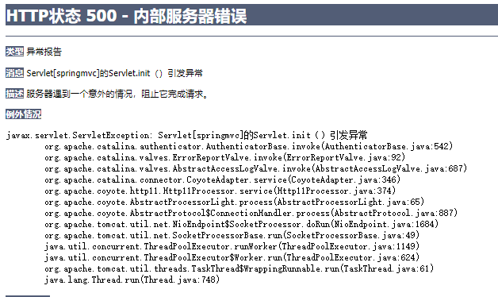
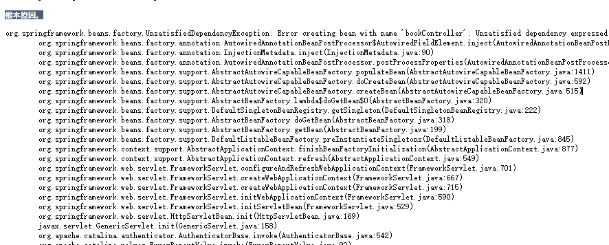
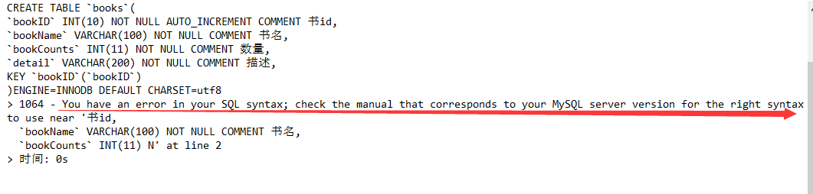

# SpringMVC

## 遇到的问题以及解决方法

配置好ssm环境后第一次启动出现错误







问题：Bean不存在

解决思路：1.看bean是否注入成功，能否成功跳转。

​					2.Junit测试单元，看代码是否能够查询出结果

​					3.如果没问题，那就不是底层出错，是springmvc出错了，根据提示是找不到bean，验证后发现，web中引用的classpath是springmvc.xml哪里买呢确实没有，bean在Spring-mvc.xml中，应该引用Application.xml，即几个配置文件结合在一起的配置文件。

bobo:

```
<build>-->

<!--        <resources>-->
<!--            <resource>-->
<!--                <directory>src/main/java/</directory>-->
<!--                <includes>-->
<!--                    <include>**/*.xml</include>-->
<!--                </includes>-->
<!--            </resource>-->
<!--        </resources>-->
<!--    </build>-->
```


## 环境配置

1.新建项目 后再pom.xml中写入依赖

```
  	 <!--    依赖-->
    <dependencies>
        <dependency>
            <groupId>junit</groupId>
            <artifactId>junit</artifactId>
            <version>4.12</version>
        </dependency>
        <dependency>
            <groupId>org.springframework</groupId>
            <artifactId>spring-webmvc</artifactId>
            <version>5.1.9.RELEASE</version>
        </dependency>
        <dependency>
            <groupId>javax.servlet</groupId>
            <artifactId>servlet-api</artifactId>
            <version>2.5</version>
        </dependency>
        <dependency>
            <groupId>javax.servlet.jsp</groupId>
            <artifactId>jsp-api</artifactId>
            <version>2.2</version>
        </dependency>
        <dependency>
            <groupId>javax.servlet</groupId>
            <artifactId>jstl</artifactId>
            <version>1.2</version>
        </dependency>
    </dependencies>
```

2.新建模块

3.添加web支持

4.配置TomCat 注意导包，以及默认的访问路径

5.配置模块的pom.xml导入json包和lombok包

```
<?xml version="1.0" encoding="UTF-8"?>
<project xmlns="http://maven.apache.org/POM/4.0.0"
         xmlns:xsi="http://www.w3.org/2001/XMLSchema-instance"
         xsi:schemaLocation="http://maven.apache.org/POM/4.0.0 http://maven.apache.org/xsd/maven-4.0.0.xsd">
    <parent>
        <artifactId>SpringMVC</artifactId>
        <groupId>org.example</groupId>
        <version>1.0-SNAPSHOT</version>
    </parent>
    <modelVersion>4.0.0</modelVersion>

    <artifactId>Springmvc05-json</artifactId>

    <dependencies>
        <dependency>
            <groupId>com.fasterxml.jackson.core</groupId>
            <artifactId>jackson-databind</artifactId>
            <version>2.11.4</version>
        </dependency>
        <dependency>
            <groupId>org.projectlombok</groupId>
            <artifactId>lombok</artifactId>
            <version>1.16.20</version>
        </dependency>
    </dependencies>
</project>
```

6.配置web.xml

```
<?xml version="1.0" encoding="UTF-8"?>
<web-app xmlns="http://xmlns.jcp.org/xml/ns/javaee"
        xmlns:xsi="http://www.w3.org/2001/XMLSchema-instance"
        xsi:schemaLocation="http://xmlns.jcp.org/xml/ns/javaee http://xmlns.jcp.org/xml/ns/javaee/web-app_4_0.xsd"
        version="4.0">

   <!--1.注册servlet-->
   <servlet>
       <servlet-name>SpringMVC</servlet-name>
       <servlet-class>org.springframework.web.servlet.DispatcherServlet</servlet-class>
       <!--通过初始化参数指定SpringMVC配置文件的位置，进行关联-->
       <init-param>
           <param-name>contextConfigLocation</param-name>
           <param-value>classpath:springmvc-servlet.xml</param-value>
       </init-param>
       <!-- 启动顺序，数字越小，启动越早 -->
       <load-on-startup>1</load-on-startup>
   </servlet>

   <!--所有请求都会被springmvc拦截 -->
   <servlet-mapping>
       <servlet-name>SpringMVC</servlet-name>
       <url-pattern>/</url-pattern>
   </servlet-mapping>

   <filter>
       <filter-name>encoding</filter-name>
       <filter-class>org.springframework.web.filter.CharacterEncodingFilter</filter-class>
       <init-param>
           <param-name>encoding</param-name>
           <param-value>utf-8</param-value>
       </init-param>
   </filter>
   <filter-mapping>
       <filter-name>encoding</filter-name>
       <url-pattern>/</url-pattern>
   </filter-mapping>

</web-app>
```


7.resources下新建springmvc-serlvlet.xml

```
<?xml version="1.0" encoding="UTF-8"?>
<beans xmlns="http://www.springframework.org/schema/beans"
      xmlns:xsi="http://www.w3.org/2001/XMLSchema-instance"
     xmlns:context="http://www.springframework.org/schema/context"
      xmlns:mvc="http://www.springframework.org/schema/mvc"
     xsi:schemaLocation="http://www.springframework.org/schema/beans
       http://www.springframework.org/schema/beans/spring-beans.xsd
       http://www.springframework.org/schema/context
       https://www.springframework.org/schema/context/spring-context.xsd
       http://www.springframework.org/schema/mvc
       https://www.springframework.org/schema/mvc/spring-mvc.xsd">

   <!-- 自动扫描指定的包，下面所有注解类交给IOC容器管理 -->
   <context:component-scan base-package="com.kuang.controller"/>

   <!-- 视图解析器 -->
   <beanclass="org.springframework.web.servlet.view.InternalResourceViewResolver"
         id="internalResourceViewResolver">
       <!-- 前缀 -->
       <property name="prefix" value="/WEB-INF/jsp/" />
       <!-- 后缀 -->
       <property name="suffix" value=".jsp" />
   </bean>

</beans>
```


```
LinkedHashMap
ModelMap 继承了LinkedHashMap，拥有LinkedHashMap的全部功能
Model：继承了ModelMap，是精简版，一般情况使用他


```

今日问题：为什么无法访问 WEB-INF下的

​		解决:WEB-INF是私有目录，只能通过路由访问，无法直接访问，直接访问呈现为本地路径且页面为源码。通常我们是使用与WEB-INF同级的文件不是WEB-INF的子级


## Json

``` js
<script src="index.jsp"/>这个地方是错误的，虽然不会报错但确实是引用不到src的文件的，因为script不支持单闭合
```


JS和Json的相互转化

```
var user={
    name:"李浩",
    age:20,
    sex:"男"
}
console.log(user);

//将js对象转化为json对象
var json=JSON.stringify(user);
console.log(json);
console.log(user);

//将json对象转化为js对象
var obj=JSON.parse(json);
console.log(obj);
```

## Mysql建库

```
CREATE DATABASE `ssmbuild`;

USE `ssmbuild`;

CREATE TABLE `books`(
`bookID` INT(10) NOT NULL AUTO_INCREMENT COMMENT 书id,
`bookName` VARCHAR(100) NOT NULL COMMENT 书名,
`bookCounts` INT(11) NOT NULL COMMENT 数量,
`detail` VARCHAR(200) NOT NULL COMMENT 描述,
KEY `bookID`(`bookID`)
)ENGINE=INNODB DEFAULT CHARSET=utf8;

INSERT INTO `books`(`bookID`,`bookName`,`bookCounts`,`detail`) VALUES
(1,Java,1,从入门到放弃),
(2,MySQL,10,从删库到跑路),
(3,Linux,5,从进门到进牢);
```


报错：

解决：需要将 书id 改为  '书id' 运行即可。