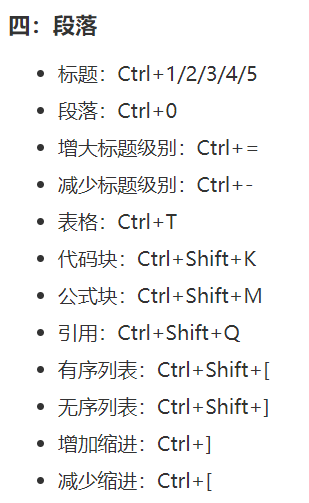
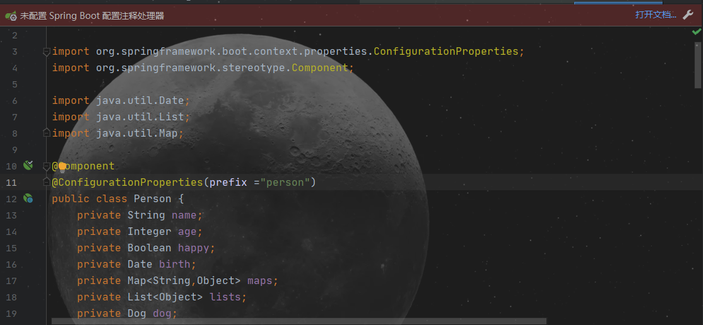
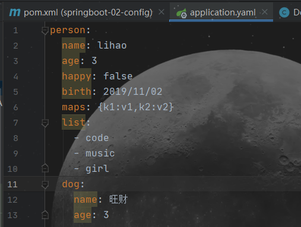
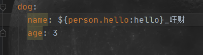
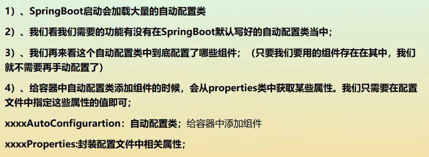
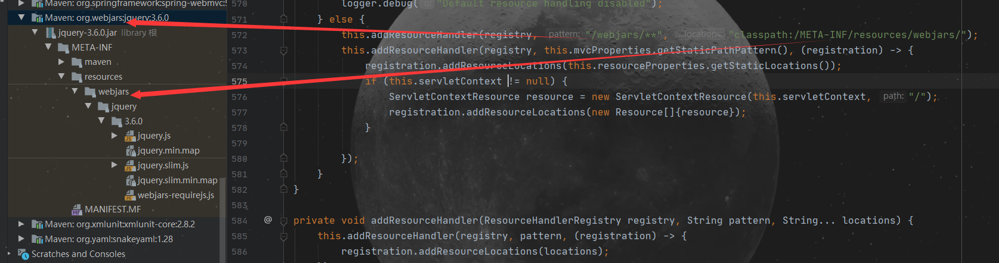

# SpringBoot

## Typora快捷键




## yaml







在pojo类中使用了注解@ConfigurationProperties，配置后会有提示，**如果不配置会爆红，但并不影响运行！**

### ${random}

Spring Boot的属性配置文件中可以通过${random}来产生int值、long值、string字符串或者UUID，来支持属性的随机值。从配置文件中获取符合规则的随机数。




￥{person.hello:hello}意思是，如果person.hello存在，那么就以存在的person.hello为值，若不存在则使用默认值“hello”，默认值就是冒号后的值。


## JSR303校验

CSDN介绍网址：https://blog.csdn.net/weixin_44440642/article/details/106335653

## SpringBoot自动装配原理

SpringBoot启动时，会加载大量的

每一个**xxxAutoConfiguration**类都是容器中的一个组件，最后都加入到容器中自动配置

每一个自动配置的类可以进行自动配置功能；

一旦这个配置类生效，这个配置类就会给容器中添加各种组件，这些组建的属性是对从对应的properties类中获取，**这些类的属性可以通过yaml配置文件更改**

所有在配置文件中能配置的属性都是在**xxxProperties**类中封装了的

精髓：




## SpringBoot Web开发

jar:webapp!

自动装配

1.创建应用，选择模块

SpringBoot帮我们配置了什么？能不能修改？能修改什么？能不能扩展？

xxxAutoConfiguration 向容器中自动配置组件

xxxProperties 自动配置类，装配配置文件中自定义的一些内容

### 能得到静态资源的方法

#### 1.webjars



进入www.webjars.org然后复制需要下载的jar的依赖

使用maven导入依赖

访问： localhost:8080/webjars/

#### 2.public,static,/**,resource

访问: localhost:8080/


### 首页配置注意


```yaml
Spring:
   mvc:
     static-path-patter: /res/**
```

这个yaml代码可以改变静态资源访问前缀，但是会导致SpringBoot的welcome注入失败！！导致无法访问到templates下的index主页

### favicon.ico配置网页图标

1.找到要做成图标的图片

2.找到网站将jpg或png格式转化成favicon.ico（文件名固定），然后放在static的包下，重启后即可显示图标。
